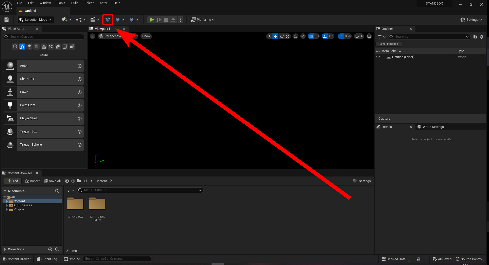
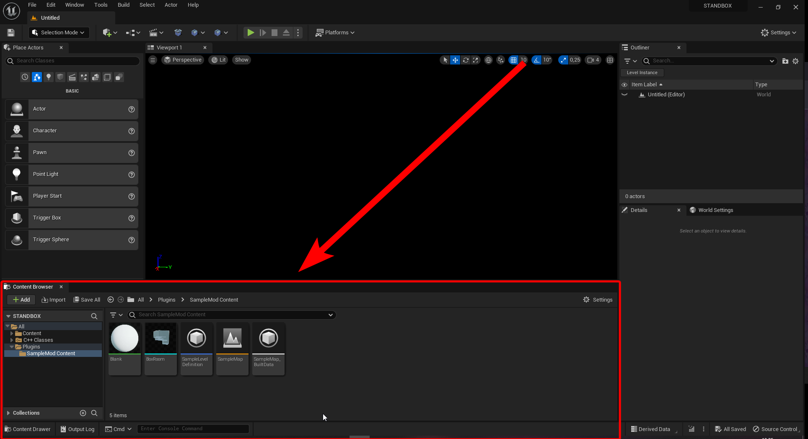

# Creating a new mod plugin

To create a new mod simply press the create mod button, choose the "Empty Mod" template, pick a name and then press the create button. This will setup a new mod plugin that you can use to create your mod.

Once you have created your mod, it will show up in the plugins section of the editor.

# Plugin content

In the plugins section you will see a Content folder, this is where you will put all of your mod content. You can create new folders and assets in this folder to organize your mod content.

