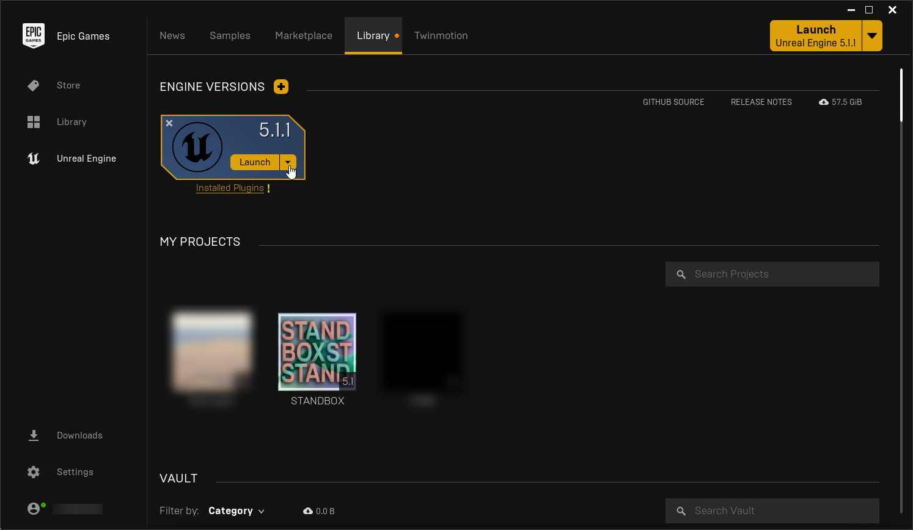

# Installing Unreal Engine
You will need Unreal Engine 5.1.1 to build your own mods for STANDBOX. You can download Unreal Engine from the [Epic Games Launcher](https://www.epicgames.com/store/en-US/download).

## To download and install Unreal Engine, you need to:
* Download and install the Epic Games Launcher.
* Sign up for an Epic Games account, if you don't have one.
* Sign in to the Epic Games Launcher.
* Install Unreal Engine 5.1.1. 

