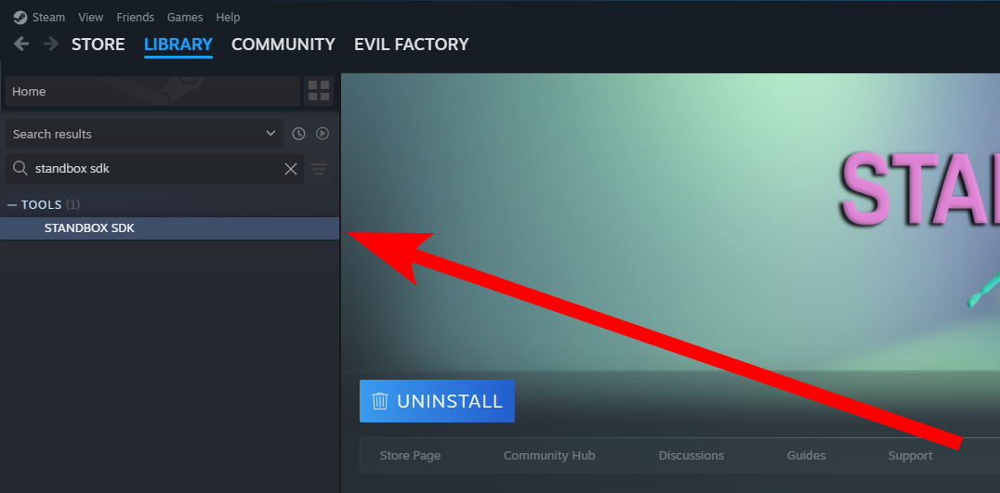
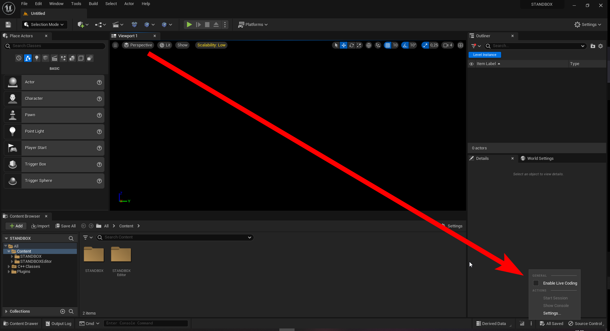

# Setting Up The Mod SDK

## Downloading the Mod SDK

You can find the SDK for STANDBOX on your steam library as a tool called "STANDBOX SDK". To download it, simply search for it on the library and click the install button.

## Opening the Mod SDK

Once you have downloaded the ModSDK, right click "STANDBOX SDK" on your library and click Manage -> Browse local files. This will open the folder where the SDK is located. Inside the folder you will find two folders, `DevBuild` and `SDK`. 

- Inside the `SDK` folder is where you will find the SDK unreal project, open it by double clicking the `STANDBOX.uproject` file.
- Inside the `DevBuild` folder, you can find a development build of STANDBOX with console, logging, etc enabled. You don't necessarily need to use this for testing, but it can be useful for debugging.

## Disabling live coding

Live coding causes issues when packaging mods, make sure to disable it here:

