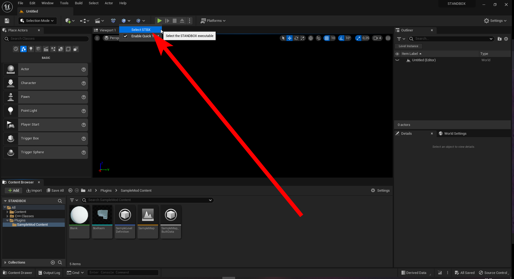
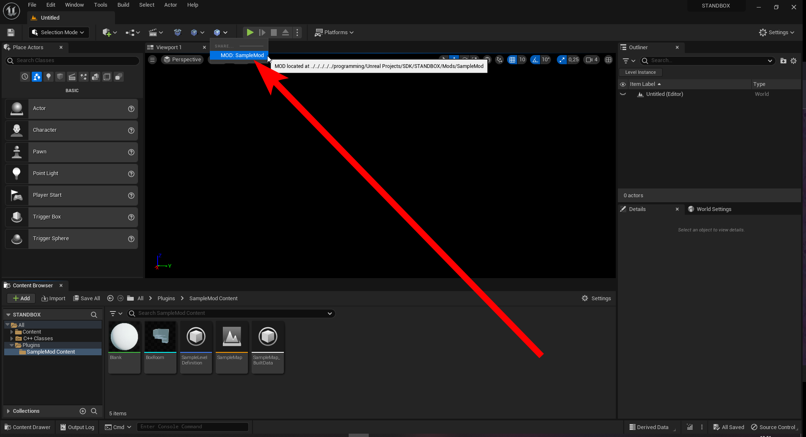

# Testing Your Mod Plugin

Now that you have created your mod plugin, you will want a way to test it quickly. This section will go over how to test your mod plugin in the game.

## Setting up

To test your mod plugin, you will have to tell the editor where the STANDBOX executable is located. To do this go over this button in the toolbar:

This will open a window where you can select the STANDBOX executable. Navigate to the folder where you installed STANDBOX and select the `STANDBOX.exe` file.

After you have selected the executable, you also have to go to the same toolbar and checkmark the "Quick Test" button.

## Testing your mod

To test your mod, simply press this button in the toolbar and select your mod plugin:

This will begin the packaging process of your mod and then launch STANDBOX with your mod loaded automatically for you to test.